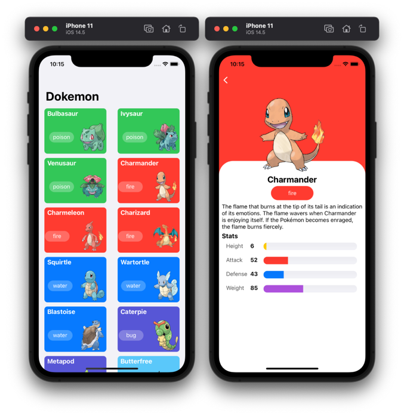

# Do-kemon

## Objective
- [x] Show pokemon list
- [x] show detail of pokemon  
- [ ] fetch api using asyn/await

## Third party list
[SDWebImageView](https://cocoapods.org/pods/SDWebImage) 

## Screenshot

## Further Reading
[Get List Pokemon](https://pokedex-bb36f.firebaseio.com/pokemon.json) 
